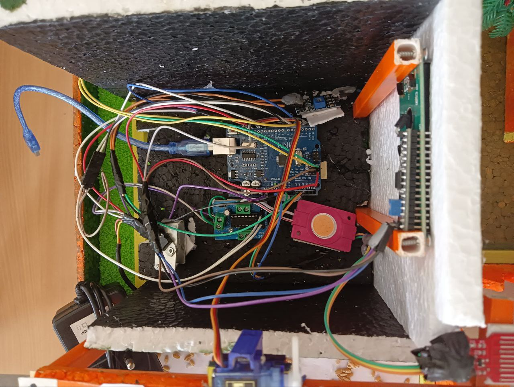

# IoT-Based Field Monitoring System

## Project Overview
The **IoT-Based Field Monitoring System** is a smart agriculture solution designed to help farmers efficiently monitor and automate crop irrigation. This system leverages IoT sensors, cloud technology, and mobile applications to provide real-time insights into field conditions.
## Photos 

## Features
- **Real-time Data Monitoring**: Continuously collects data from soil moisture, temperature, and humidity sensors.
- **Automated Irrigation**: Adjusts water supply based on sensor readings to optimize irrigation.
- **Cloud Synchronization**: Uses Firebase to store and synchronize data across devices.
- **Mobile Application**: Android app built with Kotlin for remote access to field data.
- **User Alerts & Notifications**: Sends notifications based on predefined thresholds for soil moisture and weather conditions.

## Technologies Used
- **Hardware**:
  - Raspberry Pi 3B+
  - Grove Pi Plus Sensor Shield
  - IoT Sensors (Soil Moisture, Temperature, Humidity, Light Sensor)
  - 12V DC Solenoid Valve
  - Grove Relay Module
- **Software**:
  - Python (for Raspberry Pi)
  - Firebase (Cloud Database & Real-time Sync)
  - Kotlin (Android Development)
  - Grove Pi Libraries (Sensor Integration)
  - Raspbian OS

## System Architecture
1. **Sensor Data Collection**: Sensors gather environmental data such as temperature, humidity, and soil moisture.
2. **Data Transmission**: The Raspberry Pi processes the sensor data and uploads it to Firebase.
3. **Cloud Storage & Processing**: Firebase stores and synchronizes the data across devices.
4. **User Interaction**: The Android app fetches and displays real-time data and allows remote irrigation control.
5. **Automated Irrigation**: Based on predefined thresholds, the system activates or deactivates the irrigation system.

## Installation & Setup
### Hardware Setup:
1. Connect the IoT sensors to the Raspberry Pi via the Grove Pi Plus.
2. Ensure all connections are secure and the Raspberry Pi is powered on.
## Achievements
- Successfully implemented **real-time data synchronization** with Firebase.
- Ensured **system reliability and performance** through optimized sensor data handling.
- Improved irrigation efficiency by automating water supply based on real-time sensor readings.

## Testing Methods
- **Unit Testing**: Verified individual modules (sensor data collection, Firebase integration, UI components).
- **Integration Testing**: Ensured seamless interaction between the IoT device, cloud, and mobile application.
- **End-to-End Testing**: Validated real-world scenarios, including sensor data acquisition, irrigation automation, and remote access.

## Future Enhancements
- **Predictive Analytics**: Implement AI models to predict soil moisture trends and optimize irrigation.
- **Offline Data Processing**: Enable edge computing to function in areas with limited internet access.
- **Enhanced Mobile App**: Include customizable dashboards, data visualization tools, and smart alerts.

## Contributors
- **Harsh Tiwari** – Developer 
- **Harshad Bobde** – Tester and Setup
- **Kishan Singh Rathour** – Developer
- **Parth Bhawsar** – Developer
## Contact
For any queries, reach out to **ombobde03@gmail.com** or connect via LinkedIn: [Harshad Bobde](https://www.linkedin.com/in/harshad-bobde/).
